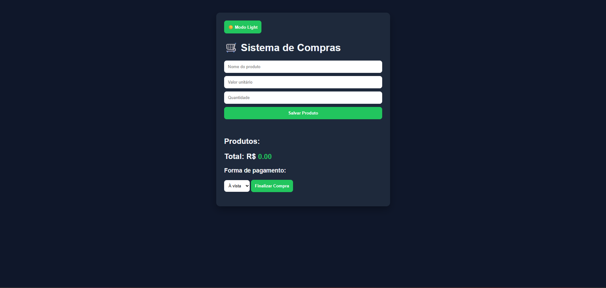

# 🛒 Sistema de Compras

Um sistema de compras desenvolvido com **HTML, CSS e JavaScript puro**, com foco em lógica de programação, manipulação do DOM e experiência do usuário.

---

## 🚀 Demonstração
🔗 https://jvicthorr.github.io/sistema-de-compras-js/

---

## ✨ Funcionalidades

- ✅ Adicionar produtos
- ✏️ Editar produtos
- ❌ Remover produtos
- 💰 Cálculo automático do total
- 🎯 Aplicação de desconto por forma de pagamento
- 💾 Persistência de dados com localStorage
- 🌗 Modo Dark/Light
- 💬 Feedback visual para o usuário

---

## 🧠 Conceitos aplicados

- Manipulação do DOM
- Estruturação de dados (arrays e objetos)
- Funções e organização de código
- Eventos em JavaScript
- Armazenamento local (localStorage)
- UX (experiência do usuário)

---

## 💻 Tecnologias utilizadas

- HTML5
- CSS3
- JavaScript (Vanilla JS)

---

## 📸 Preview

---

## 🎯 Objetivo do projeto

Este projeto foi desenvolvido com o objetivo de evoluir habilidades em desenvolvimento front-end, simulando um sistema real de compras com funcionalidades completas (CRUD).

---

## 📈 Melhorias futuras

- 🔐 Sistema de login
- 🌐 Integração com backend (Flask / Node)
- 📱 Responsividade mobile avançada
- 📊 Dashboard de compras

---

## 👨‍💻 Autor

Desenvolvido por **João Victhor Rodrigues Freitas Pinto**

📌 Em constante evolução na área de tecnologia 🚀
